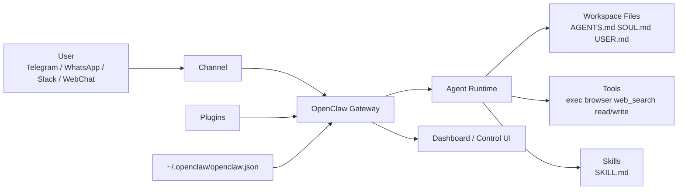
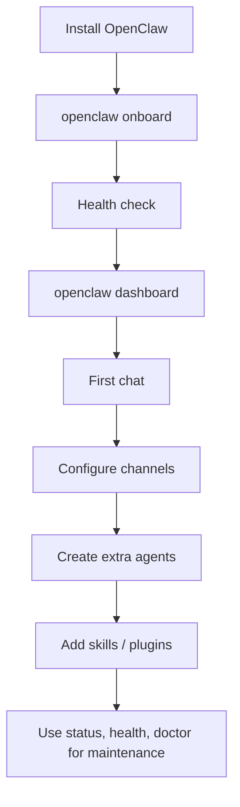

# OpenClaw ကို စတင်အသုံးပြုရန် Beginner Friendly လက်တွေ့လမ်းညွှန်

## အမှုဆောင်အကျဉ်းချုပ်

OpenClaw က သင့်စက်ပေါ်မှာ run လုပ်တဲ့ self-hosted AI assistant gateway ဖြစ်ပါတယ်။ အဓိကအကြောင်းက WhatsApp, Telegram, Slack, Discord, iMessage စတဲ့ chat channel တွေကို AI agent နဲ့ချိတ်ပေးပြီး, Gateway process တစ်ခုက sessions, routing, channel connections, dashboard access တို့ကို ထိန်းချုပ်ပေးတာပါ။ ဆိုလိုတာက “chatbot app တစ်ခု” ထက်ပိုပြီး “သင့် messaging app များနဲ့ AI agent ကြားက control center” လို့ နားလည်ရင် ပိုမှန်ပါတယ်။ 

အစပြုသူအတွက် အကောင်းဆုံး စတင်လမ်းကြောင်းက installer script ကိုသုံးပြီး `openclaw onboard` နဲ့ onboarding ပြီးတာနဲ့ `openclaw dashboard` ကနေ browser chat စကြည့်ခြင်းပါ။ Official docs ကလည်း installer script က OS ကို detect လုပ်ပေးပြီး Node လိုအပ်ရင် install ပေးကာ onboarding ကိုပါ စတင်ပေးတယ်လို့ ပြထားပါတယ်။ ပထမဆုံး run မှာ Node 24 ကို recommend လုပ်ထားပြီး Node 22.14+ ကိုလည်း support လုပ်ထားပါတယ်။ 

Windows သုံးသူဆိုရင် WSL2 လမ်းကြောင်းကိုရွေးရင် ပိုတည်ငြိမ်ပါတယ်။ macOS နဲ့ Linux သုံးသူတွေက installer script နဲ့ ရိုးရိုးစတင်လို့ရပါတယ်။ Native Windows CLI/Gateway flow က support ရှိပေမယ့် official docs က WSL2 ကို “more stable” လို့ တိုက်ရိုက် recommend လုပ်ထားပါတယ်။ 

Beginner အတွက် ပိုလွယ်ကူတဲ့ recommendation က hosted model/provider နဲ့စတာပါ။ Official docs ကလည်း best quality/security အတွက် strongest latest-generation model ကိုသုံးဖို့ ပြောထားပြီး, local model setup က context ကြီးကြီးနဲ့ prompt-injection defenses ကောင်းကောင်းလိုတာကြောင့် hardware demand မြင့်တတ်တယ်လို့ သတိပေးထားပါတယ်။ 

ပထမအပတ်မှာ သင်အရင်ကျွမ်းသင့်တဲ့ command ခြောက်ခုက `openclaw onboard`, `openclaw dashboard`, `openclaw status`, `openclaw health`, `openclaw doctor`, `openclaw config` ပါ။ အရေးကြီးဆုံး mindset က “တစ်ခုခု မပြန်ဘူးဆိုရင် reconnect လုပ်မယ်” မဟုတ်ဘဲ “status → gateway status → logs → doctor → channels status --probe” ဆိုတဲ့ ladder အတိုင်း စစ်မယ်” လို့ထားပါ။ 

မြန်မြန်ရွေးမယ်ဆိုရင် ဒီအတိုင်းသွားလို့ရပါတယ်။

1. **Windows** ဆိုရင် **WSL2** ဖြင့်စပါ။ 
2. **macOS / Linux** ဆိုရင် **installer script** နဲ့စပါ။ 
3. **Local model** မဟုတ်ဘဲ **hosted provider + API key** နဲ့ပထမဆုံး chat စပါ။ 
4. **Dashboard** ထဲက browser chat မှာ ပထမဆုံးအဖြေကို စမ်းပါ။ 
5. Debugging လုပ်ရာမှာ **doctor** ကိုအဓိက tool လို့ စိတ်ထဲထားပါ။ 

## OpenClaw ဆိုတာဘာလဲ

OpenClaw ကို ရိုးရိုးလေး နားလည်မယ်ဆိုရင် ဒီလိုပါ။ သင်က Telegram တို့ WhatsApp တို့ကနေ message ပို့တယ်။ အဲဒီ message ကို OpenClaw Gateway က လက်ခံတယ်။ ပြီးရင် agent runtime က workspace, skills, tools, model provider တို့ကိုသုံးပြီး အဖြေထုတ်တယ်။ လိုအပ်ရင် browser, exec, web search, file I/O, messaging စတဲ့ tool တွေကို ခေါ်သုံးတယ်။ နောက်ဆုံး အဖြေကိုမူလ channel ထဲပြန်ပို့ပေးတယ်။ Routing က model က စိတ်ကြိုက်ရွေးတာမဟုတ်ဘဲ host configuration အတိုင်း deterministic ဖြစ်ပါတယ်။ 

အောက်ကဇယားက official docs တွေထဲက အခြေခံ component တွေကို beginner-friendly အနေနဲ့ ပြန်စီထားတာပါ။ 

| အစိတ်အပိုင်း | အဓိပ္ပါယ် | Beginner အတွက် အဓိကမှတ်ချက် |
|---|---|---|
| **Gateway** | အဓိက daemon/process | ဒီကောင်မရှိရင် bot ကအလုပ်လုပ်မှာမဟုတ်ဘူး |
| **Agent** | AI က reason လုပ်ပြီး action လုပ်တဲ့ runtime | “brain” လို့ ယူဆလို့ရတယ် |
| **Channel** | Telegram, WhatsApp, Slack စတဲ့ message ဝင်ထွက်လမ်းကြောင်း | Message ဘယ်ကဝင်တယ်၊ ဘယ်ကိုပြန်ပို့မလဲ ဆိုတာကို ဆုံးဖြတ်ပေးတယ် |
| **Tool** | `exec`, `browser`, `web_search`, `message` စတဲ့ action function | OpenClaw က “စာပြော” ခြင်းထက် “အလုပ်လုပ်” ခြင်းကို ဖြစ်စေတဲ့အရာ |
| **Skill** | `SKILL.md` အခြေပြု လမ်းညွှန် | AI ကို ဘယ်အချိန် ဘာ tool သုံးသင့်လဲ သင်ပေးတယ် |
| **Plugin** | channel, provider, tool, skill စတာတွေကို တိုးချဲ့ပေးတဲ့ package | Core မပါသေးတဲ့ capability ကိုထည့်တယ် |
| **Workspace** | agent အလုပ်လုပ်မယ့် folder | notes, skills, persona files, bootstrap files တွေရှိတတ်တယ် |
| **Config** | `~/.openclaw/openclaw.json` | models, channels, auth, security, tools policy စတာတွေထားရာ |

OpenClaw ရဲ့ မျက်နှာချင်းဆိုင် philosophy ကလည်း ရှင်းပါတယ်။ “Your machine. Your rules.” ဆိုတဲ့ self-hosted approach ကိုတည်ဆောက်ထားပြီး chat apps အများကြီးကို Gateway တစ်ခုနဲ့ တပြိုင်နက်ဆက်နိုင်အောင် လုပ်ထားပါတယ်။ ဒါကြောင့် privacy/control လိုချင်သူ, SaaS assistant ထက် ကိုယ့် infrastructure ပေါ်မှာ run ချင်သူ, multi-channel workflow လုပ်ချင်သူတွေအတွက် အသင့်တော်ပါတယ်။ 

## Architecture နဲ့ အလုပ်လုပ်ပုံ

OpenClaw architecture မှာ Gateway က single source of truth ဖြစ်ပါတယ်။ Gateway က provider connections ကိုထိန်း, WebSocket API ပေး, events ပို့, health/presence/routing/state ကိုတစ်နေရာတည်းမှာဟန်ချက်ညီအောင် ထိန်းပါတယ်။ Clients အားလုံး—CLI, web UI, macOS app, iOS/Android nodes—က ဒီ Gateway ကို WebSocket နဲ့ ချိတ်ပါတယ်။ 



ဒီ diagram အရ beginner တစ်ယောက်အနေနဲ့ အဓိကသိထားသင့်တဲ့အချက် သုံးခုရှိပါတယ်။ ပထမတစ်ခုက **Gateway အလုပ်မလုပ်ရင် တခြားအရာတွေက အလုပ်မဖြစ်နိုင်** ပါဘူး။ ဒုတိယက **agent က workspace file တွေကို context အဖြစ်သုံးတယ်**။ တတိယက **tools/skills/plugins** က OpenClaw ကို “တိုးချဲ့နိုင်တဲ့ automation system” ဖြစ်စေပါတယ်။ 

OpenClaw ရဲ့ agent runtime က default အနေနဲ့ `~/.openclaw/workspace` ကို working directory အဖြစ်သုံးပြီး `AGENTS.md`, `SOUL.md`, `TOOLS.md`, `BOOTSTRAP.md`, `IDENTITY.md`, `USER.md` စတဲ့ user-editable files တွေကို session အသစ်ရဲ့ ပထမ turn မှာ context ထဲ inject လုပ်ပေးပါတယ်။ Multi-agent setup သုံးရင် agent တစ်ခုစီမှာ သီးသန့် workspace, state directory, sessions store ရှိပြီး inbound routing ကို bindings နဲ့ ဆုံးဖြတ်ပါတယ်။ 

အောက်ကဇယားက daily use မှာ မကြာခဏပြန်ကြည့်ရတဲ့ path နဲ့ behavior တွေကို စုထားတာပါ။ 

| Tool / Path | Default / Behavior | Beginner မှတ်ရန် |
|---|---|---|
| **Config file** | `~/.openclaw/openclaw.json` | JSON5 format; file မရှိလည်း safe defaults နဲ့ run တတ် |
| **Workspace** | `~/.openclaw/workspace` | skills, prompts, persona files ထားရန် |
| **Dashboard URL** | `http://127.0.0.1:18789/` | local admin UI; public exposure မလုပ်သင့် |
| **Gateway port** | default `18789` | onboarding မှာ ပြောင်းလို့ရ |
| **Config reload** | file save လုပ်တာနဲ့ Gateway က watch/apply လုပ်တတ် | တချို့ setting တွေက restart လိုနိုင်သေး |
| **DM policy default** | `pairing` | မသိသေးတဲ့ sender ကို code approve လုပ်ရတတ် |
| **Group policy default** | `allowlist` | group ထဲမှာ bot မပြန်ရင် allowlist / mention gating ကို စစ် |

OpenClaw configuration က JSON5 ဖြစ်ပြီး comments/trailing commas ကိုလည်းလက်ခံနိုင်ပါတယ်။ Unknown key, wrong type, invalid value ရှိရင် Gateway က refuse to start လုပ်နိုင်ပါတယ်။ ဒါကြောင့် beginner ဖြစ်လေလေ `openclaw config validate` နဲ့ `openclaw doctor` ကိုကြိုးစားသုံးသင့်ပါတယ်။ Control UI ကလည်း live schema ကိုဖတ်ပြီး config form render လုပ်ပေးပါတယ်။ 
Control UI / Dashboard က admin surface ဖြစ်တာကြောင့် public internet ပေါ် တိုက်ရိုက်ဖွင့်မထားသင့်ပါဘူး။ Official docs က localhost, Tailscale Serve, သို့မဟုတ် SSH tunnel ကို prefer လုပ်ဖို့ ပြောထားပါတယ်။ 

## OS အလိုက် installation setup လက်တွေ့လမ်းညွှန်

အောက်ကဇယားက OS အလိုက် recommended install path ကို အရင်ကြည့်ပြီး, မိမိ environment မသေချာပါက အဲဒီ recommended path ကိုပဲသွားပါ။ Windows native, Windows WSL2, macOS CLI, macOS app alternative, Linux/headless အားလုံးကို ရွေးချယ်စရာအဖြစ်ပြထားပါတယ်။ 

| OS | Recommended path | Install command | Auto-start / service | မှတ်ချက် |
|---|---|---|---|---|
| **Windows** | **WSL2** | `wsl --install` → WSL ထဲမှာ `curl -fsSL https://openclaw.ai/install.sh | bash` | WSL ထဲ systemd user service | အပြည့်စုံဆုံး compatibility |
| **Windows** | Native PowerShell | `iwr -useb https://openclaw.ai/install.ps1 | iex` | Scheduled Task, denied ဖြစ်ရင် Startup-folder fallback | core CLI/Gateway use okay, သို့သော် WSL2 ပိုတည်ငြိမ် |
| **macOS** | Installer script | `curl -fsSL https://openclaw.ai/install.sh | bash` | LaunchAgent | beginner အတွက် အလွယ်ဆုံး |
| **macOS** | CLI + OpenClaw.app | CLI install အရင်လို | app က local Gateway ကို manage/attach လုပ်နိုင် | app က Node/Gateway bundle မပါတော့လို့ CLI လိုတယ် |
| **Linux** | Installer script | `curl -fsSL https://openclaw.ai/install.sh | bash` | systemd user service | server/headless မှာကောင်း |
| **Any OS** | npm/pnpm/bun alternative | `npm install -g openclaw@latest` စသည် | OS ပေါ်မူတည် | Node ကိုကိုယ်တိုင် manage လုပ်ပြီးသားဆိုရင် okay |

**Windows WSL2 လမ်းကြောင်း**  
ဒီလမ်းက official docs အရ recommended ဖြစ်ပါတယ်။ ပထမဆုံး PowerShell ကို Administrator နဲ့ဖွင့်ပြီး WSL2 ကို install လုပ်ပါ။ Microsoft official docs က `wsl --install` command ကို recommended လုပ်ထားပါတယ်။ 

```powershell
wsl --install
wsl --list --verbose
```

WSL distro (ဥပမာ Ubuntu) ထဲဝင်ပြီး OpenClaw install လုပ်ပါ။ Official install docs အရ installer script က OS detect လုပ်ပေးပြီး Node လိုအပ်ရင်ထည့်ပေးနိုင်ပါတယ်။ 

```bash
curl -fsSL https://openclaw.ai/install.sh | bash
openclaw onboard --install-daemon
openclaw --version
openclaw doctor
openclaw gateway status
```

WSL2 ကို reboot/login မရှိဘဲ background မှာဆက် run စေချင်ရင် linger enable လုပ်ပြီး, Windows boot နဲ့ WSL ကိုဆွဲတင်ဖို့ Scheduled Task သုံးနိုင်ပါတယ်။ ဒီ step က headless / always-on setup အတွက်သာ လိုအပ်ပါတယ်။ 

```bash
sudo loginctl enable-linger "$(whoami)"
```

```powershell
schtasks /create /tn "WSL Boot" /tr "wsl.exe -d Ubuntu --exec /bin/true" /sc onstart /ru SYSTEM
```

**Windows native PowerShell alternative**  
Native Windows path ကိုသုံးမယ်ဆိုရင် install command က အောက်ကနည်းပါ။ Official docs က core CLI use နဲ့ basic Gateway use အတွက် okay လို့ပြောပေမယ့် WSL2 ကိုပဲ prefer လုပ်ထားပါတယ်။ 

```powershell
iwr -useb https://openclaw.ai/install.ps1 | iex
openclaw onboard --install-daemon
openclaw --version
openclaw doctor
openclaw gateway status --json
```

Native Windows မှာ managed startup မလိုဘဲ CLI-only စမ်းချင်ရင် health requirement ကိုကျော်သွားဖို့ `--skip-health` သုံးနိုင်ပါတယ်။ Scheduled Task creation deny ဖြစ်ရင် OpenClaw က Startup-folder login item fallback ကို သုံးတတ်ပါတယ်။ 

```powershell
openclaw onboard --non-interactive --skip-health
openclaw gateway run
```

**macOS လမ်းကြောင်း**  
macOS မှာ beginner အတွက် အလွယ်ဆုံးနည်းက installer script ပါ။ ပြီးရင် onboarding wizard ကို run လုပ်ပြီး LaunchAgent install လုပ်ခိုင်းလိုက်ရင် လုံလောက်ပြီပါပြီ။ Dashboard ကိုပြန်ဖွင့်ချင်ရင် `openclaw dashboard` သုံးပါ။ 

```bash
curl -fsSL https://openclaw.ai/install.sh | bash
openclaw onboard --install-daemon
openclaw dashboard
openclaw --version
openclaw doctor
openclaw gateway status
```

macOS app ကိုကြိုက်သူအတွက် alternative လည်းရှိပါတယ်။ Official platform docs အရ OpenClaw.app က menu-bar companion ဖြစ်ပြီး permissions, notifications, local/remote gateway attachment တို့ကိုကူညီနိုင်ပါတယ်။ သို့သော် app က Node/Bun/Gateway runtime ကို bundle မလုပ်တော့ဘဲ external `openclaw` CLI install ကိုမျှော်လင့်ပါတယ်။ 

**Linux လမ်းကြောင်း**  
Linux တော်တော်များများမှာ macOS နဲ့ တူတူ installer script ကိုသုံးရုံပါ။ Server/headless machine ဆိုရင် onboarding က GUI မတွေ့လျှင် SSH port-forward hint ပေးတတ်ပါတယ်; Dashboard ကို browser မဖွင့်ချင်ရင် `--no-open` သုံးနိုင်ပါတယ်။ Boolean service အနေနဲ့ systemd user service ကိုအသုံးများပါတယ်။ 

```bash
curl -fsSL https://openclaw.ai/install.sh | bash
openclaw onboard --install-daemon
openclaw dashboard --no-open
openclaw --version
openclaw doctor
openclaw gateway status
```

**Alternative install methods**  
Installer script မသုံးချင်ဘဲ Node ကိုကိုယ်တိုင် manage လုပ်ပြီးသားဆိုရင် npm/pnpm/bun လမ်းကြောင်းရှိပါတယ်။ pnpm သုံးရင် build scripts approve လုပ်ဖို့ `pnpm approve-builds -g` လိုပါတယ်။ Bun က global CLI install အတွက် support ရှိပေမယ့် Gateway runtime အတွက် Node ကပဲ recommended ဖြစ်ပါတယ်။ From-source install လည်း contributor / dev workflow အတွက် တရားဝင် docs ပါရှိပါတယ်။ 

```bash
# npm
npm install -g openclaw@latest
openclaw onboard --install-daemon

# pnpm
pnpm add -g openclaw@latest
pnpm approve-builds -g
openclaw onboard --install-daemon

# bun
bun add -g openclaw@latest
openclaw onboard --install-daemon
```

```bash
# from source
git clone https://github.com/openclaw/openclaw.git
cd openclaw
pnpm install && pnpm ui:build && pnpm build
pnpm link --global
openclaw onboard --install-daemon
```

**Install troubleshooting tips**  
တပ်ဆင်ပြီး `openclaw` command မတွေ့ရင် official install doc က `node -v`, `npm prefix -g`, `$PATH` ကိုစစ်ပြီး `$(npm prefix -g)/bin` ကို shell startup file ထဲထည့်ဖို့ ပြောထားပါတယ်။ npm install မှာ `sharp` / libvips issue တက်ရင် `SHARP_IGNORE_GLOBAL_LIBVIPS=1` နဲ့ install ပြန်လုပ်ပါ။ pnpm သုံးရာမှာ build approval မပေးလို့ command မပြီးပြတ်ရင် `pnpm approve-builds -g` ကို မမေ့ပါနဲ့။ 

```bash
node -v
npm prefix -g
echo "$PATH"
export PATH="$(npm prefix -g)/bin:$PATH"
```

```bash
SHARP_IGNORE_GLOBAL_LIBVIPS=1 npm install -g openclaw@latest
```

## နေ့စဉ်သုံး workflow နဲ့ အရေးကြီး command များ

Beginner အတွက် day-to-day workflow က ရှုပ်သလိုထင်ရပေမယ့် တကယ်တော့ “install → onboard → health check → dashboard/chat → config/channels → agents → skills/plugins” ပုံစံပါ။ Onboarding က local mode မှာ model/auth, workspace, gateway settings, channels, daemon install, health check, skills setup အထိ guided flow တစ်ခါတည်းလုပ်ပေးနိုင်ပါတယ်။ Remote mode လည်း ရှိပြီး remote host ကို install/modify မလုပ်ဘဲ Gateway URL နဲ့ token ထည့်ပြီး connect လုပ်နိုင်ပါတယ်။ 



အောက်ကဇယားက beginner အတွက် အများဆုံးသုံးရတဲ့ command တွေကို official CLI reference, Gateway docs, config docs, channels docs ကိုအခြေခံပြီး စုထားတာပါ။ 

| Command | ဘာလုပ်ပေးလဲ | Beginner အတွက်ဘယ်အချိန်သုံးမလဲ |
|---|---|---|
| `openclaw onboard` | onboarding wizard | ပထမ setup |
| `openclaw dashboard` | browser Control UI ဖွင့် | browser chat / config / sessions |
| `openclaw status` | session health, recent recipients, usage | “overall ဘာဖြစ်နေလဲ” စစ်ချင်ရင် |
| `openclaw health` | running Gateway health snapshot | Gateway ရဲ့ live/near-live health |
| `openclaw doctor` | repair + migration + diagnostics | တစ်ခုခုက ထင်သလိုမဖြစ်ရင် first-aid |
| `openclaw gateway run` | foreground Gateway | daemon မသုံးဘဲ test/run |
| `openclaw gateway install` | OS service install | auto-start လိုရင် |
| `openclaw config get/set/validate` | config စစ်/ပြင်/validate | config learning |
| `openclaw agents add` | agent အသစ်ဖန်တီး | personal/work ခွဲသုံးချင်ရင် |
| `openclaw agents bind` | channel traffic ကို agent နဲ့ချိတ် | multi-agent routing |
| `openclaw channels add` | channel account ထည့် | Telegram/Discord စဖြစ် />
| `openclaw channels status --probe` | live channel probe | channel ပြဿနာစစ် |
| `openclaw skills search/install/list` | skill ရှာ/ထည့်/ကြည့် | extra capability သွင်းချင်ရင် |
| `openclaw plugins list/install` | plugin စီမံ | voice call, extra channels စသည် |
| `openclaw models status/set` | model ကိုကြည့်/ပြောင်း | provider/model ပြောင်းချင်ရင် |

`openclaw config` ကို beginner အနေနဲ့ စတင်သုံးမယ်ဆိုရင် “CLI one-liner” mental model နဲ့ စလို့ကောင်းပါတယ်။ Official config docs အရ config file က `~/.openclaw/openclaw.json` ဖြစ်ပြီး JSON5 format ကိုသုံးကာ Gateway က file changes ကို watch/apply လုပ်နိုင်ပါတယ်။ Unknown key, invalid type, invalid value ရှိရင် boot မတက်နိုင်တာကြောင့် validate habit က အရေးကြီးပါတယ်။ 

```bash
openclaw config get agents.defaults.workspace
openclaw config set agents.defaults.heartbeat.every "2h"
openclaw config validate
```

အဓိက option တချို့ကိုလည်း မှတ်ထားပါ။

- `--json` က machine-readable output ပေးပေမယ့် **non-interactive mode ကိုအလိုအလျောက်မဖြစ်စေပါဘူး**။ Script အတွက် `--non-interactive` ကိုသီးသန့်သုံးရပါတယ်။ 
- `--local` က Gateway request fail ဖြစ်မှ fallback မလုပ်ဘဲ embedded agent ကိုတိုက်ရိုက် run ခိုင်းတာပါ။ 
- `--deep` က `status` / `security audit` စတာတွေမှာ ပိုပြီး live probe ပြေးပေးတတ်ပါတယ်။ 
- `--install-daemon` က onboarding အတွင်း OS-specific service ကို install လုပ်ဖို့ အသုံးများပါတယ်။ 
- `--verbose` က health/status output ကိုအသေးစိတ်တိုးစေပါတယ်။ 

## လက်တွေ့ လေ့ကျင့်ခန်းများ

အောက်က examples တွေမှာ output ကို **နမူနာ** အနေနဲ့ပြထားပါတယ်။ Model provider, release version, auth method, plugin set, OS environment ပေါ်မူတည်ပြီး actual output format က ကွဲနိုင်ပါတယ်။ သို့သော် command/methodology က official docs မှာရှိတဲ့ flow ကိုပဲ အခြေခံထားပါတယ်။ 

**Exercise 1 — Install အောင်သွားပြီလား စစ်မယ်**

ဒီ exercise ရဲ့ ရည်ရွယ်ချက်က CLI, doctor, Gateway သုံးခုစလုံးကောင်းသလား စစ်တာပါ။ Official docs က verify-the-install အတွက် `openclaw --version`, `openclaw doctor`, `openclaw gateway status` ကိုတန်းသုံးပေးထားပြီး troubleshooting doc က healthy signals အနေနဲ့ runtime running / probe ok / no blocking issues ကိုကြည့်ဖို့ ပြောထားပါတယ်။ 

```bash
openclaw --version
openclaw doctor
openclaw gateway status
```

**Expected Output**

1. `openclaw --version` က version string တစ်ခု ပြန်လာရမယ်။  
2. `openclaw doctor` က blocking config/service issue မရှိသင့်ဘူး။  
3. `openclaw gateway status` မှာ runtime running, probe ok လို healthy signal တွေမြင်ရတတ်တယ်။ 

**နမူနာ output**

```text
openclaw 1.x.y

Doctor:
- no blocking config issues
- gateway healthy

Gateway status:
Runtime: running
RPC probe: ok
```

တစ်ခုခု fail ဖြစ်ရင် ဒီလိုစမ်းပါ။ `doctor` documentation အရ automatic repair အတွက် `--repair` နဲ့ `--force` modes ရှိပါတယ်။ 

```bash
openclaw doctor --repair
```

**Exercise 2 — Browser dashboard ကနေ ပထမဆုံး chat စမယ်**

ဒါက beginner အတွက် အရေးကြီးဆုံး exercise ဖြစ်ပါတယ်။ Onboarding ပြီးရင် CLI က dashboard ကို auto-open လုပ်ပေးနိုင်ပြီး, manual re-open အတွက် `openclaw dashboard` ရှိပါတယ်။ Dashboard URL bootstrap, token/password prompt, headless hint တွေကို official dashboard doc ကရှင်းပြထားပါတယ်။ 

```bash
openclaw dashboard
```

၁။ browser ဖွင့်သွားလိုက်ပါ။  
၂။ မဖွင့်သွားရင် command output ထဲက URL ကို copy လုပ်ပါ။  
၃။ Shared-secret auth prompt တက်ရင် onboarding မှာဖန်တီးထားတဲ့ token သို့မဟုတ် password ကိုထည့်ပါ။  
၄။ Chat box ထဲမှာ ဒီလိုပို့ပါ။

```text
Reply with exactly OPENCLAW-OK.
```

**Expected Output**

OpenClaw က စာကြောင်းတိုတစ်ကြောင်းပြန်သင့်ပါတယ်။ Prompt ကိုတင်းတင်းကျပ်ကျပ်ရေးထားလို့ `OPENCLAW-OK.` တို့နီးပါးဖြစ်မယ်လို့ မျှော်လင့်နိုင်ပေမယ့် model behavior ကြောင့် punctuation ကွာနိုင်ပါတယ်။ Dashboard မချိတ်နိုင်ရင် `openclaw gateway status`, `openclaw status`, `openclaw logs --follow`, `openclaw doctor` အစဉ်လိုက် စစ်ပါ။ 

Headless Linux/server မှာ browser မဖွင့်ချင်ရင် ဒီနည်းကို သုံးပါ။ 

```bash
openclaw dashboard --no-open
```

**Exercise 3 — Work agent တစ်ခု ထပ်ဖန်တီးမယ်**

Multi-agent routing ကို novice များအတွက် အခက်ဆုံးအပိုင်းလိုထင်ရပေမယ့် သဘောတရားက ရိုးရိုးပါ။ Agent တစ်ခုစီမှာ workspace, state, sessions သီးသန့်ရှိပါတယ်။ Inbound channel traffic ကို bindings နဲ့ ဘယ် agent လက်ခံမလဲ ဆုံးဖြတ်ပါတယ်။ Official automation docs က `openclaw agents add work` example ကို တိုက်ရိုက်ပေးထားပါတယ်။ 

```bash
openclaw agents add work \
  --workspace ~/.openclaw/workspace-work \
  --model openai/gpt-5.4 \
  --bind telegram:ops \
  --non-interactive \
  --json
```

ပြီးရင် binding ကိုစစ်ပါ။

```bash
openclaw agents bindings --agent work --json
```

**Expected Output**

- `work` ဆိုတဲ့ agent အသစ်တစ်ခုရှိလာမယ်  
- `workspace-work` ဆိုတဲ့ folder ကိုသုံးမယ်  
- `telegram:ops` binding ကိုပြပေးမယ်  
- နောက်ပိုင်း `work` agent သီးသန့် persona/skills/config နဲ့ run လို့ရမယ် 

**နမူနာ output**

```json
{
  "id": "work",
  "workspace": "~/.openclaw/workspace-work",
  "model": "openai/gpt-5.4",
  "bindings": ["telegram:ops"]
}
```

Channel မသတ်မှတ်သေးဘူးဆိုရင် `--bind` ကိုဖျက်ပြီး agent တို့ workspace တို့အရင်စတင်နိုင်ပါတယ်။ Telegram token ထည့်ပြီး channel add လုပ်ဖို့ အခြေခံ syntax ကဒီလိုပါ။ 

```bash
openclaw channels add --channel telegram --token <bot-token>
openclaw agents bind --agent work --bind telegram:ops
```

**Exercise 4 — ကိုယ့်ပထမဆုံး custom skill ရေးမယ်**

ဒါက beginner အတွက် OpenClaw ရဲ့ “aha moment” ဖြစ်တတ်ပါတယ်။ Official “Creating Skills” page က hello-world skill example ကို တိုက်ရိုက်ပေးထားပါတယ်။ Skill တစ်ခုက folder တစ်ခုထဲက `SKILL.md` တစ်ဖိုင်ဆိုတာကို ဒီ exercise ကနားလည်စေပါတယ်။ 

ပထမဆုံး skill folder ဖန်တီးပါ။

```bash
mkdir -p ~/.openclaw/workspace/skills/hello-world
```

`SKILL.md` ကို create လုပ်ပါ။

```markdown
---
name: hello_world
description: A simple skill that says hello.
---

# Hello World Skill
When the user asks for a greeting, use the `echo` tool to say
"Hello from your custom skill!".
```

Skill ကို reload စေဖို့ session အသစ်ဖွင့်ပါ သို့မဟုတ် Gateway restart လုပ်ပါ။ Official docs က `/new` သို့မဟုတ် `openclaw gateway restart` ကိုပြထားပါတယ်။ 

```bash
openclaw gateway restart
openclaw skills list
```

ပြီးရင် test လုပ်ပါ။ `openclaw agent` command reference အရ session selector တစ်ခုထည့်တာက ပိုရှင်းလင်းတဲ့အတွက် beginner အနေဖြင့် `--agent main` ကိုထည့်သုံးဖို့ အကြံပြုပါတယ်။ 

```bash
openclaw agent --agent main --message "give me a greeting"
```

**Expected Output**

နမူနာ skill instruction အတိုင်း `"Hello from your custom skill!"` လိုအဖြေပြန်လာသင့်ပါတယ်။ `openclaw skills list` မှာလည်း skill ကိုမြင်ရမယ်။ 

**နမူနာ output**

```text
Hello from your custom skill!
```

**Exercise 5 — Plugin တစ်ခု ထည့်မယ်**

Plugin က OpenClaw ကို channel/provider/tool/skill/speech စတာတွေအထိ တိုးချဲ့နိုင်တဲ့ package မျိုးဖြစ်ပါတယ်။ Official plugins quick-start docs က `@openclaw/voice-call` ကို example အဖြစ် တိုက်ရိုက်သုံးထားပါတယ်။ 

```bash
openclaw plugins list
openclaw plugins install @openclaw/voice-call
openclaw gateway restart
```

လိုအပ်ရင် config ထဲမှာ plugin settings ကိုပြင်ပါ။

```bash
openclaw config set plugins.entries.voice-call.enabled true
openclaw config validate
```

**Expected Output**

- plugin install complete
- `plugins list` ထဲမှာ `voice-call` လို့မြင်ရမယ်
- restart ပြီးနောက် gateway က plugin registry ကို load လုပ်ထားမယ် 

plugin install failure ဖြစ်ပြီး config invalid ဖြစ်နေလျှင် docs က `openclaw doctor --fix` နဲ့ `openclaw plugins doctor` ကိုသုံးဖို့ အချက်ပေးထားပါတယ်။ 

## လူတွေ OpenClaw ကို လက်တွေ့ဘယ်လိုသုံးကြလဲ — Cron Jobs / Scheduled Automation Use Cases

OpenClaw ကို လူတွေ chatbot တစ်ခုလိုပဲမဟုတ်ဘဲ အချိန်အလိုက် အလုပ်လုပ်ပေးတဲ့ personal automation agent အဖြစ်လည်း သုံးကြပါတယ်။ Official docs အရ Cron က Gateway ထဲမှာ run တဲ့ built-in scheduler ဖြစ်ပြီး jobs တွေကို persist လုပ်ထားနိုင်သလို, သတ်မှတ်ချိန်ရောက်ရင် agent ကို wake လုပ်ပြီး output ကို chat channel သို့ webhook endpoint ထဲပြန်ပို့နိုင်ပါတယ်။  

Use case	ဘာလုပ်တာလဲ	Beginner example
Daily morning brief	မနက်တိုင်း news, calendar, tasks, inbox summary ပို့	“မနက် ၇ နာရီတိုင်း today plan ပြောပေး”
Reminder / one-shot task	20 minutes later, tomorrow, next Monday စတဲ့ reminder	“20 မိနစ်နေရင် deployment check လုပ်ဖို့ remind”
Weekly project report	GitHub/Slack/issues/status တွေ summarize	“တနင်္လာနေ့တိုင်း project progress summary ပို့”
Health monitoring	server, website, service, bot status စစ်	“၁ နာရီတစ်ခါ API health check လုပ်”
ChatOps alerting	result ကို Telegram/Slack/Discord channel ထဲပို့	“build fail ဖြစ်ရင် team channel ထဲ summary ပို့”
Personal admin	calendar check, email digest, finance check, habit tracking	“ညတိုင်း မနက်ဖြန် meeting တွေ summarize”
External trigger workflow	webhook ကနေ event ဝင်လာရင် agent အလုပ်လုပ်	“GitHub webhook ဝင်ရင် PR summary ထုတ်”

Cron jobs အတွက် scheduling type သုံးမျိုးကို beginner အနေနဲ့ မှတ်ထားလို့ရပါတယ်။ --at က one-time job, --every က fixed interval, --cron က recurring cron expression ပါ။ Timezone လိုရင် --tz ထည့်နိုင်ပါတယ်။  

# One-shot reminder
openclaw cron add \
  --name "Check deployment" \
  --at "20m" \
  --session main \
  --message "Remind me to check the deployment status." \
  --wake now
# Daily morning brief
openclaw cron add \
  --name "Morning brief" \
  --cron "0 7 * * *" \
  --tz "Asia/Bangkok" \
  --session isolated \
  --message "Summarize today's calendar, unread important messages, and top priorities." \
  --announce
# Weekly project report to Slack
openclaw cron add \
  --name "Weekly project report" \
  --cron "0 9 * * 1" \
  --tz "Asia/Bangkok" \
  --session isolated \
  --message "Review project updates and prepare a weekly progress summary." \
  --announce \
  --channel slack \
  --to "channel:C1234567890"

Cron နဲ့ Heartbeat ကို မရောသင့်ပါဘူး။ Cron က precise timing / recurring jobs အတွက်ကောင်းပြီး, Heartbeat က main session ထဲမှာ periodic agent turn ပြေးစေပြီး attention လိုတဲ့အရာတွေကို surface လုပ်ဖို့ သင့်တော်ပါတယ်။  

Beginner rule of thumb:

* “Every morning at 7 AM do X” → Cron သုံးပါ။
* “20 minutes later remind me” → Cron သုံးပါ။
* “အခါအားလျော်စွာ context ကြည့်ပြီး လိုတာရှိရင်ပြော” → Heartbeat သုံးပါ။
* “A → B → C multi-step workflow with approval gates” → Task Flow / managed workflow pattern ကိုစဉ်းစားပါ။  

Cron jobs တွေကို စစ်ဖို့ command တွေကဒီလိုပါ။

openclaw cron list
openclaw cron show <job-id>
openclaw cron runs --id <job-id>
openclaw cron edit <job-id>

Cron jobs တွေက default အနေနဲ့ Gateway host ပေါ်မှာ persist လုပ်ထားပြီး manual edit ထက် openclaw cron add/edit ကိုသုံးတာ ပိုလုံခြုံပါတယ်။  

## Realworld scenarios၊ အမှားများဖြေရှင်းနည်းများ၊ နောက်ထပ်ဖတ်ရန် resource များ

Official Showcase က OpenClaw ကို real projects တွေမှာ ဘယ်လိုသုံးနေကြလဲဆိုတာ ကောင်းကောင်းပြပေးပါတယ်။ အောက်ကဇယားထဲက **use case / benefit** တွေက showcase မှ, **challenge** column ကတော့ official troubleshooting/security/docs ကိုအခြေခံပြီး practical inference လုပ်ထားတာဖြစ်ပါတယ်။ 

| Realworld scenario | ဘာလုပ်တာလဲ | အကျိုးကျေးဇူး | စိန်ခေါ်မှု |
|---|---|---|---|
| **PR Review → Telegram Feedback** | Code change ပြီး PR review result ကို Telegram ထဲပြန်ပို့ | repo workflow ကို mobile chat ထဲကနေ လက်ခံဖတ်နိုင် | repo auth, routing, message formatting စနစ်တကျပြင်ရ |
| **Wine Cellar Skill from CSV** | local CSV ကိုအခြေခံပြီး custom skill တည်ဆောက် | ကိုယ့် data ပေါ်မှာ skill တည်ဆောက်ရလွယ် | data cleanliness, workspace file structure နားလည်ဖို့လို |
| **Tesco Shop Autopilot** | meal plan → cart → delivery slot → order confirm | API မရှိတဲ့ website workflow ကို browser automation နဲ့လုပ်နိုင် | browser automation fragility, login/session safety |
| **Bambu 3D Printer Control** | printer status, jobs, camera, calibration | hardware control ကို chat-native လုပ်နိုင် | plugin/skill, permissions, tooling complexity |
| **14+ Agents under one Gateway** | orchestrator agent က worker agents များကိုခွဲပေး | complex multi-agent workflow တည်ဆောက်နိုင် | routing/bindings, sandboxing, policies မမှန်ရင် ရှုပ်ထွေးလာနိုင် |
| **Home automation / air purifier / dashboards** | air quality, Grafana, home control | daily-life automation ကို chat UI တစ်ခုထဲတင်ဖြေရှင်းနိုင် | device permissions, local network exposure, security hardening လို |

ဒီ showcase stories တွေက OpenClaw ရဲ့အားသာချက်ကို သေချာပြပါတယ်။ အဲဒါက “channel-agnostic control layer” ဖြစ်လို့ API ရှိတဲ့ system များတင်မက, browser-driven workflows, files/CSV, local devices, multiple agents, voice workflows စတာတွေကိုပါ one Gateway model နဲ့ချိတ်နိုင်တာပါ။ အားနည်းချက်ဘက်ကတော့ setup complexity, channel auth, security policy, prompt-injection risk, service reliability စတာတွေကို ကိုယ်တိုင်စီမံရတာပါ။ 

**မကြာခဏတွေ့ရတဲ့ pitfall တချို့**

1. **Bot online လိုပဲမြင်ရပေမယ့် message မပြန်ဘူး**  
   အများဆုံးအကြောင်းရင်းက DM pairing pending, group mention gating (`requireMention`), channel/group allowlist mismatch ဖြစ်ပါတယ်။ Official troubleshooting docs က start လုပ်သင့်တဲ့ command ladder ကို `openclaw status` → `openclaw gateway status` → `openclaw logs --follow` → `openclaw doctor` → `openclaw channels status --probe` လို့ တိတိကျကျပေးထားပါတယ်။ 

2. **Dashboard မချိတ်နိုင်ဘူး**  
   Gateway URL မှားခြင်း, auth token/password mismatch, HTTP / secure context assumption မကိုက်ခြင်းတွေဖြစ်တတ်ပါတယ်။ Dashboard/control UI က admin surface ဖြစ်တာကြောင့် publicly expose မလုပ်ဘဲ localhost / Tailscale / SSH tunnel လမ်းကြောင်းသုံးပါ။ 

3. **Config တစ်ခါပြင်ပြီးနောက် Gateway မတက်တော့ဘူး**  
   OpenClaw က strict schema validation လုပ်တဲ့အတွက် unknown keys သို့ invalid values တွေကြောင့် boot မတက်နိုင်ပါဘူး။ ဒီလိုအချိန်မှာ `openclaw config validate` နဲ့ `openclaw doctor` ကိုသုံးပါ။ Validation fail ဖြစ်ရင် diagnostic commands များသာအလုပ်လုပ်တတ်ပါတယ်။ 

4. **Security ကို လျော့တွက်မိတယ်**  
   `openclaw security audit` docs က OpenClaw ကို default အနေနဲ့ personal-assistant trust model လို့ရှင်းပြထားပါတယ်။ မယုံကြည်ရတဲ့ user အများကြီးကို Gateway တစ်ခုတည်းနဲ့မျှဝေသုံးတာကို recommend မလုပ်ပါဘူး။ Multi-user/shared inbox setup မဖြစ်မနေလိုရင် sandboxing, separate gateways/OS users, DM scope hardening ကိုထည့်ရပါမယ်။ 

5. **Local model နဲ့စတော့ ဘာကြောင့် quality မကောင်းတာလဲ**  
   Official local-model docs က OpenClaw ဟာ long context နဲ့ prompt-injection defense ကောင်းတဲ့ model တွေကိုအထူးလိုလားတယ်လို့ ပြောထားပါတယ်။ Small/local cheap models နဲ့စရင် latency, truncation, security concerns တွေမြင့်တတ်လို့ beginner အတွက် hosted provider နဲ့စတာ ပိုလက်တွေ့ကျပါတယ်။ 

6. **Native Windows က မတည်ငြိမ်သလိုခံစားရတယ်**  
   ဒါက documentation နဲ့ကိုက်ညီပါတယ်။ Official Windows page က WSL2 ကိုပိုတည်ငြိမ်ပြီး full experience အတွက် recommend လုပ်ထားပါတယ်။ Native Windows မှာ CLI-only သို့မဟုတ် basic Gateway use လုပ်လို့ရပေမယ့် caveat များရှိပါတယ်။ 

**နောက်ထပ်ဖတ်ရန် အကြံပြု resource list**

Official doc: https://docs.openclaw.ai/start/getting-started

- **Getting Started** — ပထမဆုံးဖတ်သင့်တဲ့ official page; ၅ မိနစ်လောက်နဲ့ running Gateway + auth + first chat ရဖို့ ရည်ရွယ်ထားပါတယ်။ 
- **Install** — installer script, npm/pnpm/bun, from source, verify, PATH troubleshooting အားလုံးပါတဲ့ canonical install page။ 
- **Onboarding (CLI)** — `openclaw onboard` ကို ဘာတွေ configure ပေးသလဲဆိုတာ beginner-friendly အနေနဲ့ရှင်းထားတဲ့ page။ 
- **CLI Reference** — command များကို စုံလင်ဆုံး reference အနေနဲ့ရှုနိုင်တဲ့ page။ 
- **Configuration** နဲ့ **Configuration Reference** — `openclaw.json` format, hot reload, schema validation, channels, tools, secrets စတာသင်ယူဖို့။ 
- **Tools and Plugins** — tool, skill, plugin ရဲ့ ကွာခြားချက်ကို နားလည်ဖို့ အကောင်းဆုံး page။ 
- **Skills** နဲ့ **Creating Skills** — custom SKILL.md ရေးခြင်း, precedence, allowlists, hello-world example အတွက်။ 
- **Troubleshooting** နဲ့ **Doctor** — stuck ဖြစ်တိုင်း ပြန်သုံးရမယ့် official runbook နှစ်ခု။ 
- **Security / Security Audit** — OpenClaw ကို public/real-world deployment လုပ်မယ်ဆို မဖြစ်မနေဖတ်သင့်တဲ့ page များ။ 
- **Windows platform page** နဲ့ **Microsoft WSL install docs** — Windows user များအတွက် recommended path နားလည်ဖို့။ 
- **macOS app docs** — menu-bar app, permissions, local/remote gateway attachment ကိုသုံးချင်ရင်။ 
- **GitHub repository** — source code, releases, issues, docs directory, community activity ကိုတိုက်ရိုက်ကြည့်ချင်ရင်။ 

အဆုံးသတ်အနေနဲ့, beginner တစ်ယောက်အတွက် OpenClaw ကိုလေ့လာရာမှာ အရေးကြီးဆုံးအချက်က **feature များလို့ မကြောက်ပါနဲ့** ဆိုတာပါ။ ပထမနေ့မှာ installer → onboarding → dashboard → first chat လောက်ပဲရအောင်လုပ်ပါ။ ဒုတိယအဆင့်မှာ `doctor`, `status`, `config` ကိုလေ့လာပါ။ တတိယအဆင့်မှာ agent, skill, plugin, channel ကိုတစ်ခုချင်းထည့်ပါ။ ဒီလိုသွားရင် OpenClaw ကို “ကြီးမားလှတဲ့ platform” လို့မခံစားဘဲ “တစ်ဆင့်ချင်းစီတက်သွားလို့ရတဲ့ toolkit” လို့မြင်လာပါလိမ့်မယ်။ 
